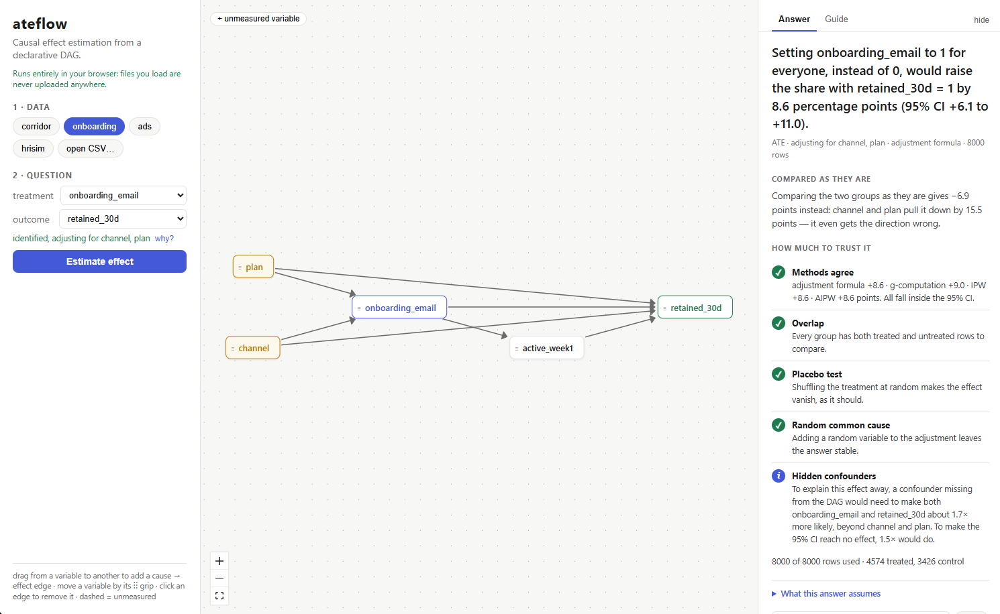
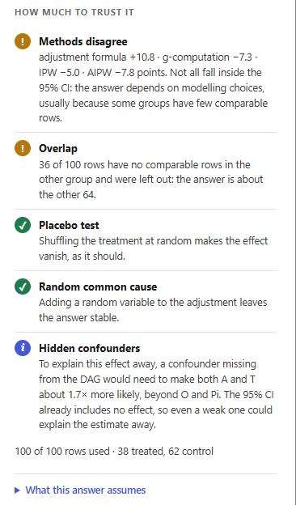
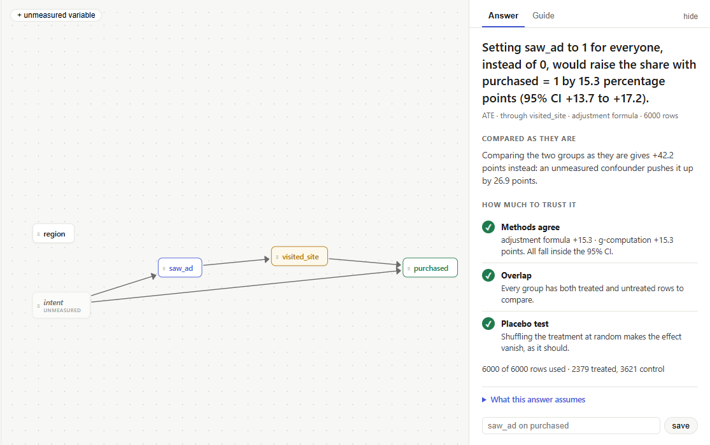

# ateflow

**Did X really cause Y?** Answer it from a CSV and a causal diagram, in your
browser, in plain words.

[](https://github.com/aasterr/ateflow/actions/workflows/ci.yml)
[](https://aasterr.github.io/ateflow/)
[](LICENSE)

**[Open the app →](https://aasterr.github.io/ateflow/)** · nothing to install, no account, your file never leaves the page



---

## The problem

You sent an onboarding email to some users, and the users who got it retain
*worse*. Does the email hurt? Probably not: the team emailed the users it
feared would churn. A direct comparison mixes the effect of the email with
the reasons it was sent.

ateflow separates the two. You say how the variables influence each other,
by drawing arrows. ateflow works out which comparison removes the bias, runs
it, and tells you the result the way you would tell a colleague:

> Setting onboarding_email to 1 for everyone, instead of 0, would raise the
> share with retained_30d = 1 by **8.6 percentage points** (95% CI +6.1 to +11.0).
>
> Comparing the two groups as they are gives −6.9 points instead: channel and
> plan pull it down by 15.5 points — it even gets the direction wrong.

## How it works

1. **Open your data.** A CSV as it comes out of your tool: separators,
   decimal commas and Excel encodings are detected. Or start from one of the
   bundled examples.
2. **Draw your assumptions.** Every column is a box on the canvas. Drag from a
   cause to its effect. Variables that matter but were never measured get a
   dashed box.
3. **Ask the question.** Pick the treatment (something done or not done) and
   the outcome. ateflow tells you immediately whether the diagram makes the
   effect computable, and why.
4. **Read the answer.** One click. Change an arrow and estimate again to see
   how much the answer depends on it.

## What the answer tells you

**The effect, in words**, with its 95% interval: in percentage points for a
yes/no outcome, in the outcome's own units for a number. If the interval
includes zero, the answer says the data cannot tell the direction.

**Why the direct comparison was wrong**: how far the naive difference is from
the answer, and which variables pulled it there.

**How much to trust it**: a checklist that is allowed to say no.

| Check | What it asks |
|---|---|
| Methods agree | Every estimator that applies runs on the same rows. Do they all land inside the interval? |
| Overlap | Does every group have both treated and untreated rows, or was part of the data left out? |
| Placebo test | If the treatment is shuffled at random, does the effect vanish as it should? |
| Random common cause | Does adjusting for an extra random variable leave the answer alone? |
| Hidden confounders | How strong would a confounder missing from the diagram need to be to explain the effect away? (E-value) |

On the real robot data below, once the diagram also links `Pi` to `Pe`, the
checklist flags that the estimators disagree,
that 36 of 100 episodes had nothing to compare with, and that the interval
includes no effect. The answer stays honest instead of confident.



## Why ateflow

- **Private by construction.** The engine is a Python package compiled to
  WebAssembly and runs in your browser tab. There is no server to send data to.
- **Assumptions you can see and change.** The diagram *is* the analysis. Move
  an arrow and the adjustment, the estimate and the explanation follow.
- **Refuses instead of guessing.** Adjusting for a mediator, a collider or a
  consequence of the treatment is refused. When no measured set of variables
  removes the confounding, ateflow tries the front-door route, and otherwise
  explains which path makes the effect impossible to compute.
- **No estimator to pick.** You are not asked to choose between g-computation
  and doubly robust weighting. ateflow chooses, says what it chose, and shows
  the others as a check.

## Bundled examples

Three synthetic datasets with a known true effect, and one real dataset.

| Example | Question | The trap | Direct comparison | ateflow | Truth |
|---|---|---|---|---|---|
| onboarding | Does an onboarding email raise 30-day retention? | Emails targeted at users likely to churn | −6.9 pts | +8.6 pts | +9 pts |
| corridor | Does a robot's LED make people walk faster? | The LED turns on in crowds, where people walk slowly | −0.130 | +0.151 | +0.15 |
| ads | Does seeing an ad make people buy? | Purchase intent drives both, and was never measured | +42.2 pts | +15.3 pts | +15 pts |
| hrisim | Does a robot's signal help it cross a corridor? | Real data: obstacles drive both signal and success | −20.7 pts | +6.1 pts | — |

Each example has a guide in the app with DAG edits to try in one click, and
the numbers each edit produces.



### Validated on real data

`hrisim` holds the 100 episodes of the
[PeopleFlow](https://github.com/aasterr/PeopleFlow/tree/main/analysis) dataset,
from the thesis *Causal Effect Estimation of Robot Actions for Human Aware
Navigation* (University of Padua, 2026). ateflow reproduces its estimates to
the third decimal: naive −0.207, adjusted for obstacles +0.061, and +0.108
when the diagram also links `Pi` to `Pe`, computed on the 64 episodes where
both groups occur. `tests/test_hrisim.py` pins them.

## Scope

ateflow answers one question: **given a treatment with two values and a
causal diagram, how much does the outcome change once confounding is
removed?** It estimates the average treatment effect (ATE) and nothing else.

Out of scope, by choice: treatments with more than two values, effects over
time, instrumental variables, discovering the diagram from data, effects by
subgroup.

## Under the hood

**Identification.** The diagram is parsed into a DAG. ateflow searches for a
minimal adjustment set with Pearl's backdoor criterion (d-separation by
moralization of the ancestral graph, restricted to ancestors so wide datasets
stay fast). If every backdoor set would need an unmeasured variable, it tries the
front-door criterion. Every decision comes with the paths that justify it.

**Estimation.** Four estimators share one interface:

- the adjustment formula, exact within groups of confounder values;
- g-computation, a linear outcome model with treatment interactions;
- inverse probability weighting, with a logistic propensity model (saturated
  when the confounders are discrete) and clipped weights;
- AIPW, doubly robust: right if either the outcome or the propensity model is.

The primary estimator is the adjustment formula when the confounders are
discrete and AIPW when one is continuous (for front-door: the front-door
formula, or a two-step linear model). Intervals are percentile bootstrap with
500 resamples.

**Sensitivity.** The E-value (VanderWeele & Ding, 2017) is computed on the risk
ratio of the adjusted means, with its interval from the same bootstrap. For a
numeric outcome it uses the approximate conversion from the standardized
difference; that conversion is a rule of thumb, and the app shows the
number as approximate with a warning next to it. It is not computed for
front-door answers, which already allow an unmeasured confounder.

**Data intake.** Delimiter, decimal comma and encoding are detected; column
names are cleaned for the diagram. Each column is profiled (two values,
categories, numeric, identifier, free text, empty). Rows with missing values
in the variables a question uses are dropped and counted. A treatment labelled
`yes/no`, `sì/no`, `treated/control` and similar is coded automatically;
other pairs ask which value is the treatment. Identifiers and free text
cannot be adjusted for. Files are limited to 20 MB.

**One engine, two ways in.** The web app runs `ateflow/service.py` in a Web
Worker on Pyodide; the CLI and Python users call the same package directly.
Every sentence of the answer comes from `ateflow/answer.py`. There is no
server: saved analyses stay in the browser's IndexedDB, dataset included, and
export as a standalone HTML report.

## Python and command line

```bash
pip install -e .
python -m ateflow --data examples/onboarding.csv --dag examples/onboarding.dag \
    --treatment onboarding_email --outcome retained_30d
```

A diagram file has one relation per line, and chains are allowed. A variable
with no column in the data is declared on an `unmeasured: name` line.

```
plan -> onboarding_email
channel -> onboarding_email
plan -> retained_30d
channel -> retained_30d
onboarding_email -> active_week1 -> retained_30d
onboarding_email -> retained_30d
```

```python
from ateflow import DAG, estimate_ate

res = estimate_ate(df, DAG.from_file("examples/onboarding.dag"),
                   treatment="onboarding_email", outcome="retained_30d")
res.adjusted.value, res.adjusted.ci, res.methods_agree, res.sensitivity
```

## Running and developing

```bash
pip install -e ".[dev]"
python examples/make_data.py                  # the synthetic example datasets
pytest -q                                     # the engine, pinned to known effects

cd frontend && npm install
npm run dev                                   # the app with hot reload
npm run smoke                                 # the engine under Pyodide in Node
npm run build                                 # static site into frontend/dist
```

The public app is built and published to GitHub Pages by
`.github/workflows/pages.yml` on every push to `master`, after the Pyodide
smoke test passes. To host it elsewhere, serve `frontend/dist` from any
static file host.

## License

MIT © Francesco Baldo
