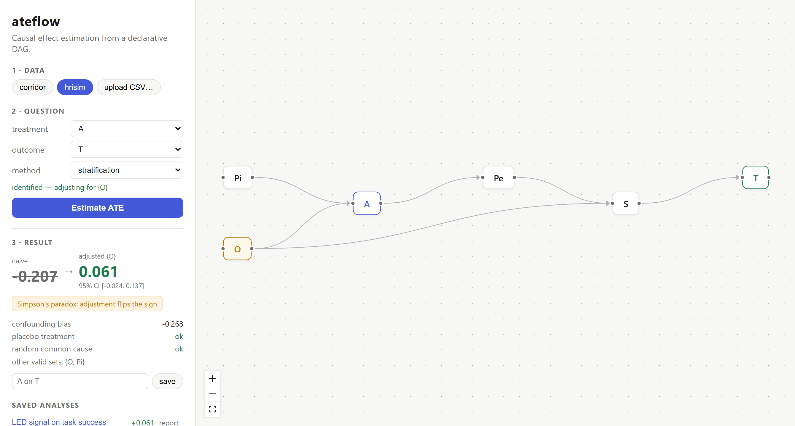

# ateflow

Causal effect estimation from a declarative DAG.

[](https://github.com/aasterr/ateflow/actions/workflows/ci.yml)
[](https://aasterr.github.io/ateflow/)
[](LICENSE)

**The question it answers, and only that one:** given a binary treatment and a DAG,
how much does the outcome change net of confounders?

Everything that does not serve this sentence stays out.

**[Try it →](https://aasterr.github.io/ateflow/)** — open a CSV, draw the DAG, get the estimate.
**Everything runs in your browser**: the engine is the same Python package,
compiled to WebAssembly with [Pyodide](https://pyodide.org), so the file you
open is never uploaded anywhere. The first visit downloads Python, numpy and
pandas (a few seconds, then cached); an estimate with 500 bootstrap resamples
and the refutation tests takes 2–5 seconds.



## Usage

The DAG is a text file, one relation per line:

```
crowding -> led
crowding -> speed
led -> speed
led -> waiting_time
```

From the command line:

```bash
python -m ateflow --data examples/corridor.csv --dag examples/corridor.dag \
    --treatment led --outcome speed
```

```
naive            ATE = -0.130   adjusting for: none
g-computation    ATE = +0.150  95% CI [+0.143, +0.157]   adjusting for: crowding

confounding bias : -0.280
sign flip        : YES
refutation placebo_treatment      ok        mean=-0.0000, sd=+0.0037
refutation random_common_cause    ok        shift=-0.0000, max_drift=+0.0002
```

The true ATE of the synthetic dataset is +0.15. The unadjusted estimate has the
wrong sign: `crowding` turns the LED on more often and lowers speed at the same
time.

From Python:

```python
from ateflow import DAG, estimate_ate

res = estimate_ate(df, DAG.from_file("examples/corridor.dag"),
                   treatment="led", outcome="speed")
print(res.report(), res.sign_flip, res.confounding_bias)
```

## Product analytics example

Did the onboarding email raise 30-day retention? The growth team sent it
mostly to the users it feared would churn — free plan, paid-ads signups — so
the raw comparison says the email *hurts*:

```bash
python -m ateflow --data examples/onboarding.csv --dag examples/onboarding.dag \
    --treatment onboarding_email --outcome retained_30d
```

```
naive            ATE = -0.069   adjusting for: none
g-computation    ATE = +0.090  95% CI [+0.067, +0.114]   adjusting for: channel, plan

confounding bias : -0.158
sign flip        : YES
```

The true effect is +9 retention points. The DAG also marks `active_week1` as
a mediator: ateflow refuses to adjust for it, because doing so would recover
only the direct +4 points and hide the half of the effect that works by
bringing users back in their first week.

## Validation on real data

`examples/episodes_100_v1.csv` holds the 100 HRI episodes of the
[PeopleFlow](https://github.com/aasterr/PeopleFlow/tree/main/analysis) dataset:
a robot traversing a corridor and deciding whether to emit an LED signal (`A`),
with success/timeout as the outcome (`T`) and static obstacles as the
confounder (`O`).

```bash
python -m ateflow --data examples/episodes_100_v1.csv --dag examples/hrisim.dag \
    --treatment A --outcome T --method stratification
```

ateflow reproduces the estimates of the reference thesis to the third decimal:
naive −0.207 (sign inverted by confounding), backdoor on `{O}` +0.061, backdoor
on `{Pi, O}` +0.108 on the 64 episodes with overlap — the stratum `Pi=0, O=0`
contains no treated episode and is dropped, not imputed.
`tests/test_hrisim.py` pins these numbers as a regression.

## Web app

A visual DAG editor over the same engine: load an example or open a CSV,
draw the arrows, and the minimal adjustment set updates live as the graph
changes; one click runs the full estimate with bootstrap CI and refutations.

The app is static. `ateflow/service.py` holds the request logic; in the page
it runs inside a Web Worker on Pyodide, and saved analyses (dataset included)
stay in the browser's IndexedDB. The same module backs the optional FastAPI
server, so the two front doors cannot drift apart.

```bash
python examples/make_data.py                  # example datasets bundled into the build
cd frontend && npm install && npm run build   # builds into ateflow/static
npm run smoke                                 # the engine under Pyodide in Node, checked against pinned numbers
```

Serve `ateflow/static` with any static file server, or with the API:
`pip install -e ".[server]" && uvicorn ateflow.server:app`.

### Bringing your own CSV

Open the file as it comes out of your tool. ateflow detects the delimiter
(comma, semicolon, tab, pipe), a decimal comma and Windows encodings, so an
Excel export with Italian locale reads as-is. A data check then shows every
column with what it looks like — two values, categories, numeric, an ID,
free text, all missing — and leaves IDs and empty columns out of the DAG.

When a question is asked:

- the treatment must have exactly two values. `0/1`, `true/false`,
  `yes/no`, `sì/no`, `treated/control` are coded automatically; for any other
  pair (`1/2`, `A/B`) you choose which one is the treatment
- the outcome must be numeric or have two values (you choose which counts as 1)
- rows with a missing value in the variables the question uses are dropped;
  how many, and because of which column, is reported with the result
- an ID or free-text column cannot be adjusted for, and stratification refuses
  continuous confounders — the error says what to do instead

The same checks run from the CLI (`--treated-value`, `--outcome-positive`)
and from Python, where `Result.data_report` holds the details. Uploads are
limited to 20 MB.

Analyses can be saved (dataset included, so they always reload) and exported
as a standalone HTML report with the DAG drawn inline — ready to print to PDF.

For development, `npm run dev` serves the app with hot reload. The HTTP API
(`uvicorn ateflow.server:app`) exposes `/api/estimate`, `/api/dag/check`,
`/api/columns`, `/api/examples` and SQLite-backed `/api/analyses` — docs at
`/docs`; set `ATEFLOW_DB` to move the database file.

## Deploy

The public demo is published to GitHub Pages by `.github/workflows/pages.yml`
on every push to `master`, after the Pyodide smoke test passes.

To self-host, the Dockerfile builds the same static app and serves it with the
API from one container:

```bash
docker build -t ateflow .
docker run -p 8080:8080 -v ateflow_data:/data ateflow
```

## What it does today

- DAG with acyclicity checking and chain parsing (`a -> b -> c`)
- d-separation by moralization of the ancestral subgraph
- Pearl's backdoor criterion, search for the minimal set and the alternative sets
- explicit refusal of mediators, colliders, and descendants of the treatment
- estimation by g-computation (with T*Z interactions) and by stratification
- inverse probability weighting and doubly robust AIPW, with overlap
  diagnostics: clipped propensities and effective sample size. With discrete
  confounders the propensity model is saturated, so a cell with no treated
  units is flagged instead of being smoothed over
- percentile bootstrap intervals
- refutation tests: placebo treatment, random common cause

## What it does not do (by choice)

Non-binary treatments, longitudinal data, front-door, instrumental variables,
causal discovery, heterogeneous effects by subgroup. They are extensions, not
requirements.

## Development

```bash
pip install -e ".[dev]"
python examples/make_data.py
pytest -q
```

`tests/test_estimate.py` is the regression test of the whole project: if a
refactoring breaks the recovery of the known ATE, the pipeline is broken.
